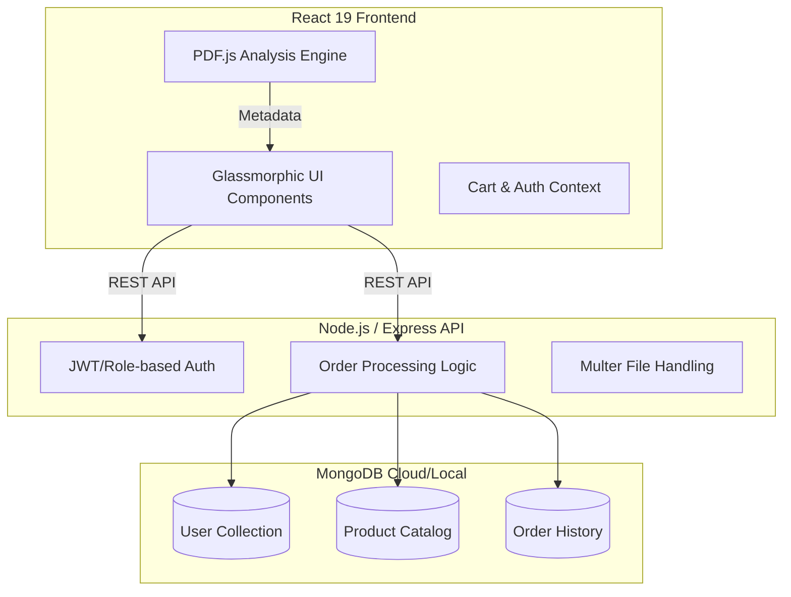

# 🚀 CampusCart: The Ultimate Student Utility Hub

<div align="center">
  
  
  
  
  
</div>

---

## 🌟 Project Overview

**CampusCart** is a high-performance, full-stack ecosystem designed to revolutionize campus life. It bridges the gap between students and essential campus services by providing a unified digital storefront for **stationery supplies** and **automated document printing**. 

Built with a focus on premium aesthetics and robust engineering, CampusCart eliminates the friction of physical queues and manual calculations, offering a seamless "Order → Pay → Pickup" workflow for the modern academic environment.

### 🚩 Why it Matters
- **Queue Elimination**: Digitize the entire stationery and printing process.
- **Transparent Pricing**: Real-time cost calculation for complex print jobs.
- **Admin Efficiency**: Automated order queues with real-time status updates.
- **Premium UX**: A glassmorphic, dark-mode interface designed for Gen-Z.

---

## ✨ Features

### 🛒 Dynamic Stationery Marketplace
- **Categorized Shopping**: Intuitive browsing through diverse stationery categories.
- **Smart Cart System**: Persistent state management for multi-item orders.
- **Instant Checkout**: Integrated payment flow with UPI/Digital wallet support.

### 📄 Intelligent Print Orchestration
- **PDF Analysis Engine**: Client-side parsing using `PDF.js` to extract page counts and metadata.
- **Custom Print Profiles**: Configure copies, color/BW, and layout with instant price updates.
- **Drag-and-Drop Ingestion**: Seamless file upload interface with real-time validation.

### 🔔 Smart Notification System
- **Real-time Order Tracking**: Automated polling system (3s interval) that monitors order status.
- **Instant Alerts**: Browser-based toast notifications triggered when orders transition to "Ready" status.
- **Duplicate Prevention**: State-aware notification tracking to ensure clean UX.

### 🧑‍💼 Admin Command Center
- **Live Order Queue**: Real-time synchronization with the backend for zero-latency management.
- **Lifecycle Control**: Granular order management (Pending → Printing → Ready).
- **Dashboard Analytics**: Revenue and order volume visualization.

---

## 🏗️ System Architecture

CampusCart follows a decoupled **Client-Server Architecture** optimized for scalability and rapid iteration.



---

## 🛠️ Tech Stack

### **Frontend**
- **Framework**: React 19 (Latest stable)
- **Routing**: React Router 7
- **Logic**: Axios (API calls), PDF.js (Client-side document parsing)
- **Styling**: Vanilla CSS (Custom design system with design tokens)
- **State**: React Context API

### **Backend**
- **Runtime**: Node.js v20+
- **Framework**: Express.js (v5.x)
- **Database**: MongoDB with Mongoose ODM
- **Security**: Bcrypt (Password hashing)
- **Uploads**: Multer for handling multi-part form data

---

## 📂 Project Structure

```text
TechnoSphere_CampusCart/
├── backend/
│   ├── config/         # Database and environmental configuration
│   ├── controllers/    # Business logic (Auth, Orders)
│   ├── models/         # Mongoose schemas (User, Product, Order)
│   ├── routes/         # Express API endpoints
│   └── server.js       # Application entry point
├── frontend/
│   ├── public/         # Static assets
│   └── src/
│       ├── components/ # Reusable UI elements
│       ├── context/    # Global state management
│       ├── pages/      # Route-level components (Admin, Student, Auth)
│       └── App.js      # Main router and app shell
└── Progress.md         # Development log and roadmap
```

---

## ⚙️ Installation & Setup

### Prerequisites
- Node.js (v18 or higher)
- MongoDB (Running locally or MongoDB Atlas)

### 1. Clone the Repository
```bash
git clone https://github.com/your-username/TechnoSphere_CampusCart.git
cd TechnoSphere_CampusCart
```

### 2. Backend Setup
```bash
cd backend
npm install
# Create a .env file and add:
# MONGO_URI=mongodb://localhost:27017/campuscart
npm start
```

### 3. Frontend Setup
```bash
cd ../frontend
npm install
npm start
```

---

## 🛡️ Core APIs

| Endpoint | Method | Description | Access |
| :--- | :--- | :--- | :--- |
| `/api/auth/login` | `POST` | User authentication | Public |
| `/api/products` | `GET` | Fetch stationery catalog | Student |
| `/api/orders` | `POST` | Create new order (Stationery/Print) | Student |
| `/api/orders` | `GET` | Fetch all orders | Admin |
| `/api/orders/:id/status`| `PATCH`| Update order status | Admin |

---

## 📈 Performance & Scalability
- **Client-side Processing**: PDF parsing is handled in the browser to reduce server compute load.
- **Optimized Polling**: Admin dashboard uses controlled polling intervals for near real-time updates without overloading the DB.
- **Stateless API**: Designed to be easily containerized and scaled behind a load balancer.

---

## 🔮 Future Improvements
- [ ] **Push Notifications**: Real-time alerts when orders are ready.
- [ ] **Payment Gateway**: Integration with Razorpay/Stripe.
- [ ] **Inventory Sync**: Real-time stock tracking for stationery.
- [ ] **Mobile App**: PWA conversion for on-the-go ordering.

---

## 🤝 Contributors
- **Mohammed Sahil** - *Lead Developer & Architect*

---

## 📄 License
This project is licensed under the **ISC License**.

---

<div align="center">
  <p>Built with ❤️ for the student community.</p>
  <sub>TechnoSphere CampusCart © 2026</sub>
</div>
